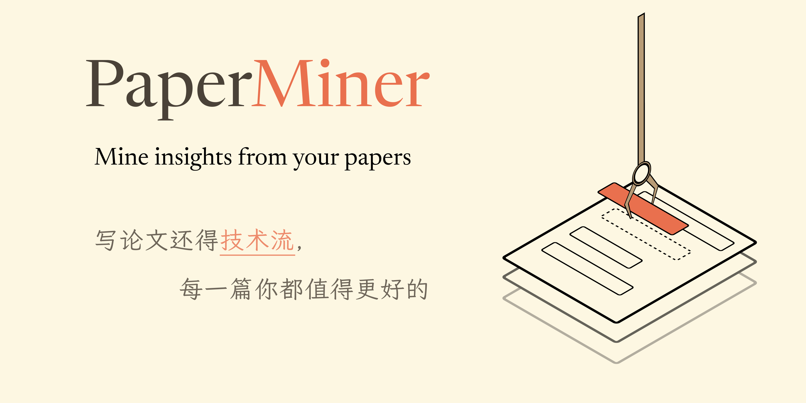
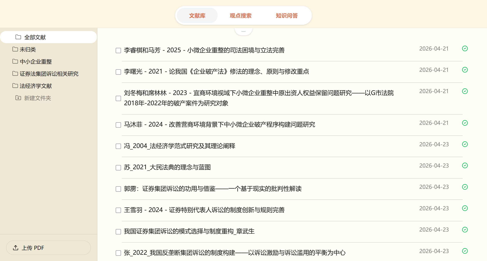
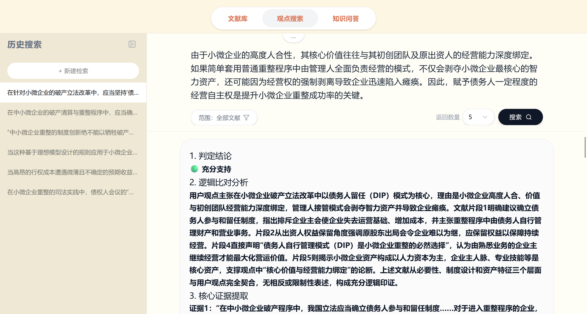
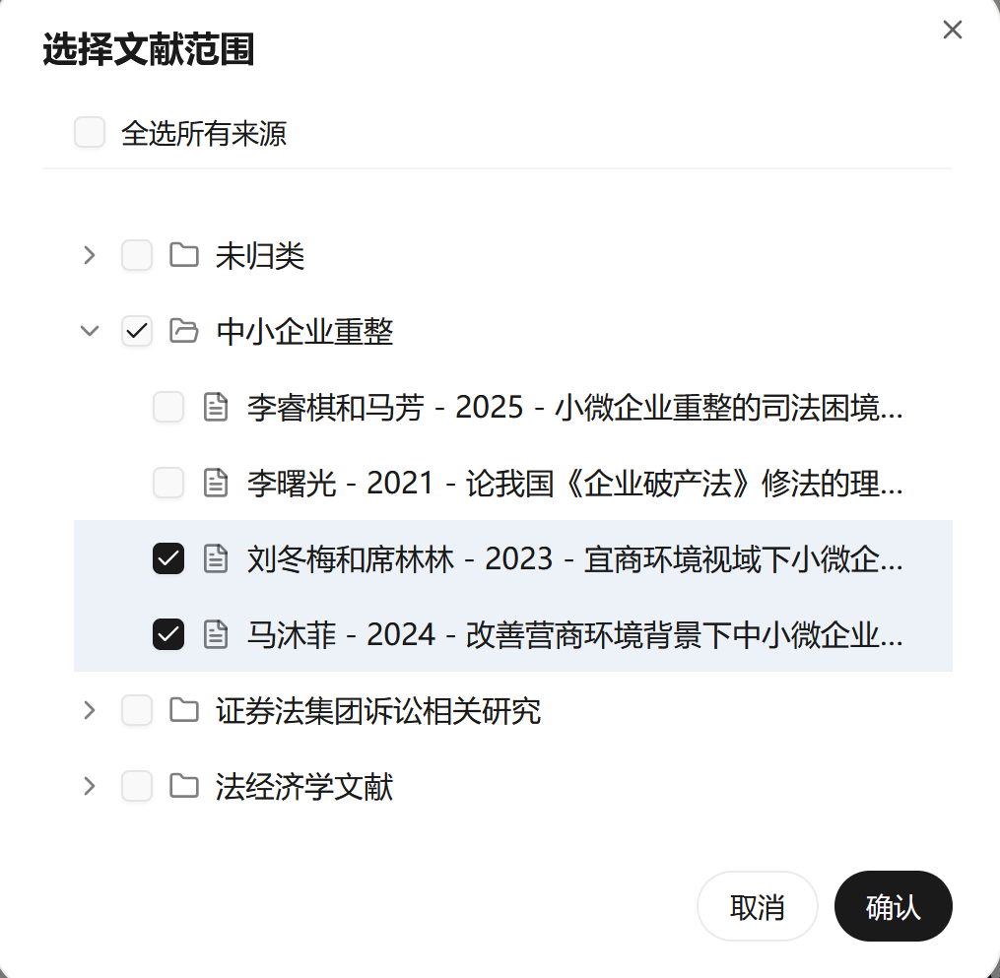
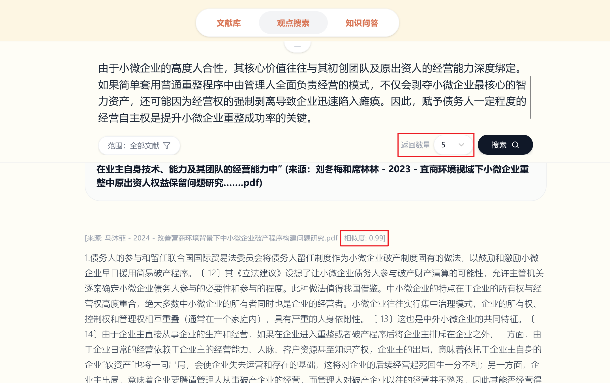
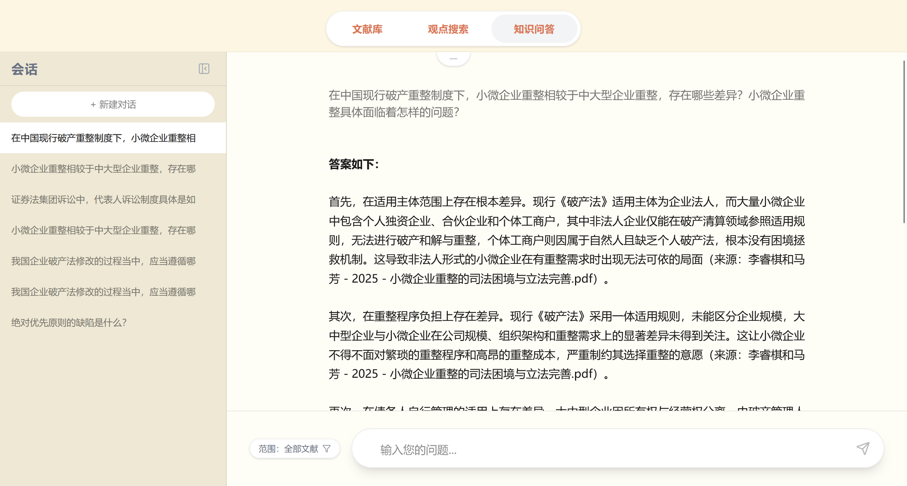
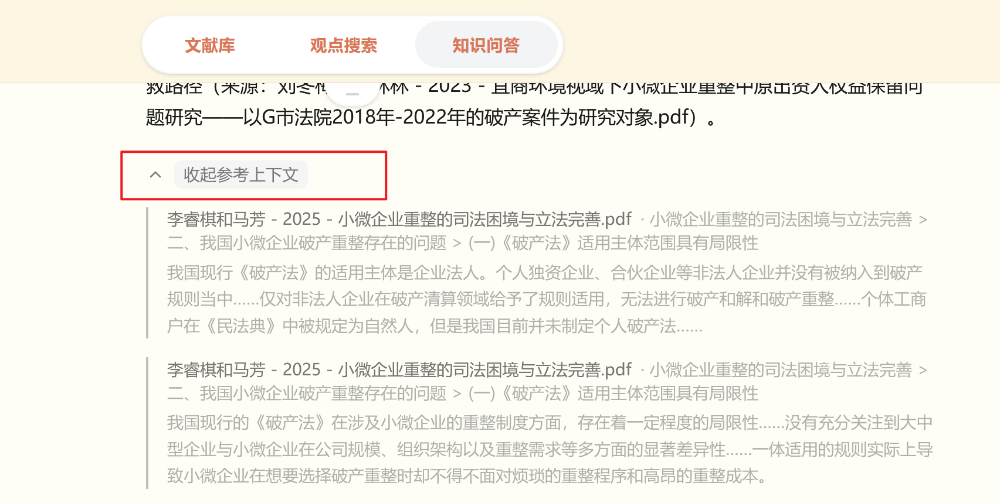

# PaperMiner——Mine insights from your papers


## 简介
<u>*写论文还得技术流，
每一篇 你都值得更好的*</u>

如果你是一位经常写论文的法学生，那你大概经历过这些情境：

（1）登录知网框框下，打开文献猛猛读。初稿写作一时爽，补充脚注火葬场。“这个观点我曾见过的。” **在哪儿？我怎么找不到具体段落了？**

（2）“**每页至少3个脚注！**”“**你的脚注还不够多，继续补充。**” 看着导师的修改意见，你该去哪儿补充文献呢？知网的高级检索用了又用、检索式换了再换，**却总是难以精准筛选到符合论点的段落。**

（3）“这个概念是什么？搜一下” （上传了20篇相关论文） 三个问题问完，“**当前对话已达到上下文限制，无法继续回答问题。**”

以上情境，都是我的真实经历。尤其是写作学位论文时，耗时久、文献数量多，自己的想法最终成型，距离最初读到参考文献可能已经过去很久，再想回头找就难上加难。临近交稿，脚注数量总是不够，显得论文“原创性太高”。偶尔有问题，塞一堆文献给AI，没问两句就到限制，只能从头再来。

如果你也曾经被这些问题烦恼，那么PaperMiner，也许是你的好帮手。

本项目的命名源于幼时经常玩的《黄金矿工》,在游戏里，你放下钩子，钩中黄金，赚取分数。而在写论文的时候，PaperMiner将像一位矿工一样协助你进行写作：开采矿石（分析论文），提炼论点（嵌入+向量化），储存数据，回答问题。

你想让它帮你**快速模糊定位参考文献**？没问题。
**帮你找脚注**？不在话下。
**基于整个文献库提问**？easy，问多少都可以。

这就是我开发PaperMiner的核心目标：帮助你从“**关键词式检索**”，升级到“**论点式检索**”。


## 核心功能


### 模块一：文档库


这里是你存储论文文献的地方，上传论文pdf，自动完成解析、清洗、分块和向量化存储。

左侧是文件夹区，你可以在此自由创建文件夹以分类管理文献。

右侧是文献条目区，上传成功后所有的文献都会显示在本区域。拖拽单条或多条文献到左侧的文件夹里，即可完成分类。支持文献条目的单条及批量删除。
文献条目后显示“✅️”则说明上传成功，如果出现“❌️”，点击图标，系统会自动清除残余数据，并重新解析论文。


### 模块二：观点搜索


#### 简介
本模块负责**进行论点的支持度分析**。你可以直接输入你论文中的某一段内容，系统会在文献筛选器限定的范围内，自动检索能够支持输入内容所含论点的原文片段，并对论证支持度进行分析。

输出内容分为两部分，第一部分为分析结论：首先直接说明分析结果（🟢 充分支持 / 🟡 部分支持 / 🔴 明确反驳 / ⚪ 缺乏支撑），之后结合文献详细论证分析结果，最后说明主要参考文献。

第二部分为原文片段：系统会基于用户设定的topk数值，召回与用户上传论文论点最相似的k个论文片段，供用户参考。

**你可以用这个模块分析某部分论点的引注是否全面、自己的论证是否充分，或单纯补充脚注。**

#### 文献筛选功能
点击检索输入框左下角的“范围”，将会单独弹窗。你可以在此**筛选本次检索的文献范围**。 如果你在文献库中上传了多个不同主题的文献，**则可以只勾选与目标主题相符的文件夹，避免其他文献干扰检索**。


#### TopK选择功能
在“搜索”按钮的左侧，你可以自由选择本次检索召回的原文片段数量，默认数量为5，你可以设置为3/5/10/15/20.
针对召回的每个文段，都会列明其原文献，以及召回片段与用户输入论点的相似度。



#### 补充：本模块的chunk召回逻辑
chunk召回采取了两个逻辑：发给LLM的chunk筛选逻辑为“**相似度得分≥0.7**”，符合标准的chunk数多于5个时取前5，不足5个时全部计入。

而在论证支持度分析下方列出的文献，会**固定按照用户设置的topk数量显示k个文献**，这些文献的**相似度可能低于0.7。**

### 模块三：知识问答


本模块负责提供类网页版AI的**对话式知识问答**功能，你可以询问任何与上传文献相关的问题。系统在分析问题后，会自动筛选与问题最相关的文献片段，然后连带问题一起发给Deepseek，让其基于文献回答你的问题。如果文献库中不包含相关信息，Deepseek会直接说明缺乏参考信息。

输入问题时，你同样可以使用文献筛选功能，方法同模块二。

答案以分点结构化的形式列出，并在每个要点后说明引用的原文段落。

在答案末尾，还会详细列出本次回答参考的原文段落，以便你快速锁定文献。



## 功能边界（暨下一步更新方向）
1.暂时只支持对**中文法学论文**的识别。**中文著作、网络报刊文章、学位论文、英文论文**未进行识别及chunk切分算法优化，效果无法保证。日后会增设识别路由，补充不同格式文章的识别&chunk切分算法。

2.暂不支持对**公式、图片、表格**等内容的识别。请尽量避免上传富含表格的文献，以免污染chunk库。

3.暂时只支持识别**PDF格式**的论文。Word/TXT等格式无法识别。

4.模块二和模块三**可以跨模块进行单线程查询**（也即，你可以在模块二输入论点搜索之后，切换到模块三提问问题），但是，模块二和模块三现在**暂不支持并发查询**（你无法在发送一个检索或提问请求之后，通过新建检索或新建问答来继续检索或进行提问。）


## 快速开始
(本项目所有操作均在Visual Studio Code中完成，推荐先安装VS Code(https://code.visualstudio.com/Download)  以便在终端中执行以下安装命令)


### 环境要求

本项目在以下环境下开发和测试，建议使用相同或更高版本（使用不同版本前，请确认兼容性）：

| 工具 | 版本 |
|------|------|
| Python | 3.13.0 |
| Node.js | 24.14.0 |
| pnpm | 10.33.0 |
| Git | 2.53.0 |

### 具体操作步骤

#### 1.克隆命令（终端执行）
```bash
git clone https://github.com/SiliconFox044/PaperMiner.git
cd PaperMiner
```

#### 2.安装依赖（终端执行）
```bash
pip install -r requirements.txt
```

#### 3.配置环境变量
将 `Paper_RAG/config/example.env` 复制并重命名为 `Paper_RAG/config/.env`，然后填写对应的 API Key
```bash
1.DEEPSEEK_API_KEY=
#为模块二“论证支持度分析”和模块三“知识问答”提供LLM接入,可在官网申请（https://platform.deepseek.com/）

2.ZHIPU_API_KEY=
#调用Embedding-3模型。新人注册有免费token，足够新建基础规模文献库。智谱api_key官网（https://bigmodel.cn/apikey/platform）

3.SILICONFLOW_API_KEY=
#Rerank重排环节依赖，免费。需在SiliconFlow官网申请api（https://cloud.siliconflow.cn/me/account/ak）

4.MINERU_API_KEY=
#pdf解析依赖，免费。需在MinerU官网申请api（https://mineru.net/apiManage/token）
```

#### 4.启动服务
##### 启动后端（端口 8000）
```bash
python server.py 
```

##### 启动前端（端口 5173）
```bash
cd frontend
pnpm install   # 首次克隆后执行，之后不需要重复
pnpm dev
```
然后在任意浏览器中打开：http://localhost:5173/

#### 5.启动成功验证
##### 前端
看到 Local: http://localhost:5173/ 即为启动成功
##### 后端
看到 Uvicorn running on http://0.0.0.0:8000 即为启动成功


## 技术栈

### 前端

- **框架**: React 18 + Vite 6
- **UI 库**: Tailwind CSS 4 + shadcn/ui + Radix UI
- **动画**: Framer Motion
- **图标**: Lucide React

### 后端

- **框架**: FastAPI 0.110 + Uvicorn
- **RAG 核心**: LangChain 
- **向量数据库**: Qdrant（本地持久化）
- **Embedding**: 智谱 AI Embedding-3（2048 维）
- **LLM**: DeepSeek
- **重排序**: SiliconFlow BGE Reranker
- **PDF 解析**: MinerU

## 系统架构

```
┌─────────────────────────────────────────────────────────┐
│  前端 (Vite + React, port 5173)                         │
│  ├─ 文档库 ─── PDF 上传与文件夹管理                       │
│  ├─ 观点搜索 ── 向量检索 + 重排序 + LLM 分析              │
│  └─ 知识问答 ── 对话式问答 + 原文引用                       │
└────────────────────────────┬────────────────────────────┘
                             │ HTTP REST
                             ▼
┌──────────────────────────────────────────────────────────┐
│  后端 (FastAPI, port 8000)                               │
│  ├─ /api/retrieve  ─── 观点搜索                           │
│  ├─ /api/answer    ─── 知识问答                           │
│  ├─ /api/upload   ─── PDF 上传与异步处理                   │
│  ├─ /api/documents/* ─ 文档库 CRUD                        │
│  └─ /api/folders/* ── 文件夹 CRUD                         │
└────────────────────────────┬─────────────────────────────┘
                             │
        ┌────────────────────┼────────────────────┐
        ▼                    ▼                    ▼
  Qdrant (向量)       data/papers/ (源文件)     LLM API
  data/qdrant/        data/paper_registry.json  (SiliconFlow/ZhipuAI)
```

## 目录结构

```
TEST002/
├── frontend/                    # React 前端
│   └── src/app/
│       ├── App.tsx              # 根组件（标签页路由）
│       ├── api.ts               # API 客户端
│       ├── components/
│       │   ├── document-library.tsx  # 模块一：文档库
│       │   ├── OpinionSearch.tsx      # 模块二：观点搜索
│       │   ├── knowledge-qa.tsx       # 模块三：知识问答
│       │   ├── DocumentSelectionModal.tsx  # 文献范围筛选弹窗
│       │   └── ui/
│       │       └── select.tsx         # shadcn Select 组件
│       └── context/
│           └── DocumentTreeContext.tsx # 文件夹树共享状态
├── Paper_RAG/                   # RAG 核心库
│   ├── core/
│   │   ├── main.py              # PDF 处理流程编排
│   │   └── retry_utils.py        # 失败任务重试清理
│   ├── pipeline/
│   │   ├── pdf_parser.py        # MinerU PDF 解析
│   │   ├── text_cleaner.py      # Markdown 清洗
│   │   ├── chunk_splitter.py    # 分块（Token 边界控制）
│   │   ├── embedding.py         # 批量 Embedding
│   │   └── vector_store.py       # Qdrant 向量存储
│   ├── retrieval/
│   │   └── retrieval.py         # 向量检索 + BGE 重排序
│   ├── generation/
│   │   └── generation.py        # LLM 问答与观点分析链
│   ├── registry/
│   │   ├── paper_registry.py    # 文档元数据与文件夹树
│   │   └── md5_records.py        # MD5 去重记录
│   └── utils/
│       ├── inspector.py          # 检查点保存与解析
│       └── progress.py          # 结构化日志
├── server.py                    # FastAPI 服务入口
├── scripts/
│   ├── clean_orphan_chunks.py   # 清理孤立向量
│   └── reindex_all_papers.py    # 重新索引所有文档
└── data/                        # 数据目录
    ├── papers/                  # 源 PDF 文件及处理后的chunk数据
    ├── qdrant/                  # Qdrant 向量数据库
    ├── paper_registry.json      # 文档注册表
    └── md5_records.json         # MD5 去重记录
```

## 数据存储

| 路径 | 说明 |
|------|------|
| `data/papers/` | 原始 PDF 文件与清洗后的 chunks.json（每个论文使用单独文件夹存放） |
| `data/qdrant/` | Qdrant 向量数据库（chunks 向量化后存储位置） |
| `Paper_RAG/data/checkpoints/` | 流水线各阶段检查点数据（解析/清洗/分块/向量化），用于调试与重试 |
| `data/history/` | 会话历史持久化目录，包含观点搜索历史（opinion.json）、知识问答历史（qa.json）及当前活跃会话 ID（qa_current.json） |
| `data/paper_registry.json` | 文档元数据与文件夹结构（模块一文献管理界面各类数据的核心存储区域） |
| `data/md5_records.json` | MD5 去重记录 |
| `data/failed_batches.jsonl` | Embedding 失败批次日志，用于排查向量化异常 |

## 维护脚本

```bash
# 清理孤立向量（文档已删除但向量残留）
python scripts/clean_orphan_chunks.py

# 重新索引所有文档
python scripts/reindex_all_papers.py
```

## 联系作者
本项目由SiliconFox044独立设计并开发
如有问题或建议，欢迎提交 Issue 或通过以下方式与我联系：
- GitHub：[@SiliconFox044](https://github.com/SiliconFox044)
- 邮箱：Vesud_Ted@163.com

## 许可证 / License
本项目基于 [MIT License]开源。